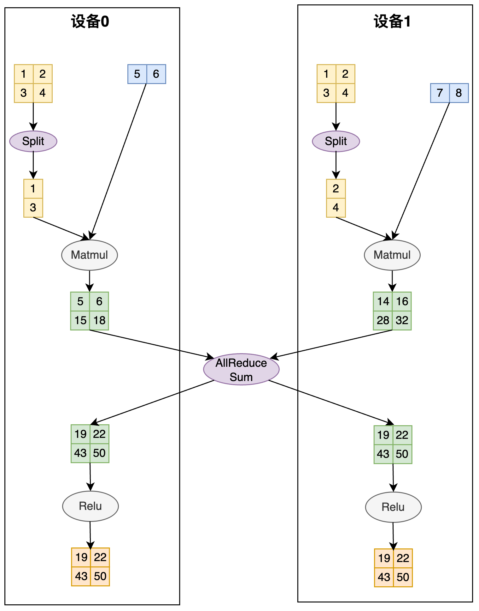

自动并行训练
=======================

# 一、背景动机

超大模型已经成为 AI 最重要的核心竞争力之一，随着模型规模持续快速增长，各种并行策略和关键技术相继提出，可以看出底层平台技术已呈收敛趋势，超大模型分布式训练逐渐地从『增量』过渡到『存量』竞争。如何更灵活支持各类应用场景对复杂并行策略的需求，如何帮助用户更简单进行分布式训练，如何兼容动态图灵活调试和静态图性能优势的优点等都是亟待解决挑战。

飞桨当前支持分布式训练当前有几种方式：动态图手动并行（动手）、静态图手动并行（静手）、动静统一自动并行（自动并行）几种方式。

手动并行（包括动态图手动并行和静态图手动并行）需要用户在组网时直接感知到分布式实现的细节，例如通信原语``Allreduce``、``Allgather``，通信组 ``process_group``，以及在组网中添加各类并行策略相关的 API，例如张量并行的 ``ColumnParallelLinear`` 和 ``RowParallelLinear`` 等，对于不同的分布式并行策略，都需要调用不同的接口，相对来说比较使用起来复杂。

自动并行为了降低用户开发分布式程序的门槛，提供了对不同分布式并行策略的统一抽象，让用户可以通过 `张量切分` 的语法标记即可实现不同并行策略。用户仅需使用少量的张量切分标注，框架便能自动推导出所有张量和算子的分布式切分状态，并添加合适的通信算子。同时自动并行还支持一键动转静分布式训练，开发者可以快速实现任意混合并行策略，大幅简化了混合并行训练代码的开发过程。

# 二、基本概念

## 2.1 自动并行 API

根据功能，我们将自动并行支持的 API 分为标记信息、动转静、Save&Load 三类。

1.1 标记信息
* paddle.distributed.shard_tensor：标记创建分布式张量
* paddle.distributed.reshard：重切分，可以从一种分布式状态转换到另一种分布式状态
* paddle.distributed.shard_layer：根据用户传入的条件，将组网中的参数转换为分布式张量
* paddle.distributed.shard_dataloader：根据用户传入的条件，将 dataloader 中的张量转换为分布式张量
* paddle.distributed.shard_optimizer：将优化器转变为分布式视角，定制化优化器状态的切分方式

1.2 动转静
* paddle.distributed.to_static：将带有分布式切分信息的动态图 layer 动转静为静态图模型


1.3 存储和加载模型
* paddle.distributed.save_state_dict：保存模型参数结构到指定路径
* paddle.distributed.load_state_dict：从指定路径加载模型

## 2.2 分布式张量

目前已有的分布式策略，数据并行、模型并行等，都是通过（1）切分输入/输出（2）切分模型参数 （3）切分计算 这三种方式，满足在多计算设备上加速训练大模型的需求。为了提供更易用的分布式接口，我们引入分布式张量这一概念，描述由多个计算设备上的局部物理张量通过既定计算共同组成的逻辑张量，用户可以通过 paddle.distributed.shard_tensor 来创建分布式张量。

为了描述分布式张量和计算设备之前的映射关系，我们引入 ``Placements`` 和 ``ProcessMesh`` 两个分布式概念。``ProcessMesh`` 可以理解为是用一个高维矩阵对分布集群中计算设备的抽象，比如一个4机32卡的集群可以用一个shape=[4,8] 的mesh 矩阵进行描述；``Placements`` 是由 ``Replicate``、``Shard``、``Partial`` 三种分布式标记组成的列表，长度和 ``ProcessMesh`` 的维度个数一致，用于表示分布式张量在对应计算设备的维度上，按照什么方式做切分，这三种分布式标记的详细描述如下：

* Replicate，指张量在所有计算设备上保持全量状态。
* Shard(axis)，指将张量沿 axis 维度做切分后，放到不同的计算设备上。
* Partial，指每个计算设备只拥有部分值，需要通过指定的规约操作才能恢复成全量数据。


在如下的示例中，我们希望在 6 个计算设备上，创建一个形状为(4, 3)的分布式张量，其中沿着计算设备的 x 维，切分张量的 0 维；沿着计算设备的 y 维上，切分张量的 1 维。最终，每个计算设备实际拥有大小为(2, 1)的实际张量，如图所示。

```python
import paddle
import paddle.distributed as dist

mesh = dist.ProcessMesh([[2, 4, 5], [0, 1, 3]], dim_names=['x', 'y'])

dense_tensor = paddle.to_tensor([[1,2,3],
                                 [4,5,6],
                                 [7,8,9],
                                 [10,11,12]])

placements = [dist.Shard(0), dist.Shard(1)]
dist_tensor = dist.shard_tensor(dense_tensor, mesh, placements)
```


## 2.3 张量重切分

如果我们希望改变一个分布式张量在集群中的分布式状态，需要使用``重切分`` 功能， 框架中通过``paddle.distributed.reshard``接口提供。
通过重切分我们可以支持跨 ``ProcessMesh`` 的分布式张量转换，比如，我们可以把在[0, 1] 两个设备上状态为 ``Replicate`` 的分布式张量，转换到 [2, 3] 这两个设备上，并变成状态为 ``Shard`` 的分布式张量。

```python
import paddle
import paddle.distributed as dist

mesh0 = dist.ProcessMesh([0, 1], dim_names=['x'])
mesh1 = dist.ProcessMesh([2, 3], dim_names=['x'])

dense_tensor = paddle.to_tensor([[1,2,3],
                                 [4,5,6]])

placements0 = [dist.Replicate()]
placements1 = [dist.Shard(0)]

dist_tensor = dist.shard_tensor(dense_tensor, mesh0, placements0)
dist_tensor_after_reshard = dist.reshard(dist_tensor, mesh1, placements1)
```


# 三、原理简介

下面我们用一个简单的列子介绍自动并行框架底层的执行流程和原理。

在单卡逻辑视角下我们希望完成计算 C = Matmul(A, B)，D = Relu(C)。
假设用户将TensorB 标记成按列切分，表示在实际分布式集群中TensorB 被按行切分到不同的Devices 上。将TensorA 标记成复制，表示所有Devices 上都有完整TensorA 副本。

```python
import paddle
import paddle.distributed as dist

mesh = dist.ProcessMesh([0, 1], dim_names=['x'])
dense_tensorA = paddle.to_tensor([[1,2,], [3,4]])
dense_tensorB = paddle.to_tensor([[5,6], [7,8]])
placementsA = [dist.Replicate()]
placementsB = [dist.Shard(0)]

dist_tensorA = dist.shard_tensor(dense_tensorA, mesh, placementsA)
dist_tensorB = dist.shard_tensor(dense_tensorB, mesh, placementsB)
dist_tensorC = Matmul(dist_tensorA, dist_tensorB)
dist_tensorD = relu(dist_tensorC)
```
<div style="text-align: center;">

<!--  -->
</div>

接下来就会进入自动并行的第一个核心逻辑 **切分推导**。
当前用户标记的输入切分状态是无法被Matmul算子实际计算的(TensorA 的第0维和TensorB 的第1维不匹配)。
这时候自动并行框架会使用当前算子的切分推导规则(e.g. MatmulSPMD Rule)，根据输入tensors 的切分状态，推导出一套合法且性能较优的 输入-输出 张量的切分状态。
在上述输入的切分状态下，框架会推导出会将 TensorA 的切分状态推导成按列切分，TensorB 保持切分状态不变，Matmul 的计算结果 TensorC 的切分状态是Partial。
因为后续的Relu 算子是非线性的，输入不能是Partial 状态，所以框架会根据 ReluSPMD Rule将 TensorC 输入 Relu 前的的分布式状态推导成 Replicated。
<div style="text-align: center;">

</div>

接下来就会进入自动并行的第二个核心逻辑 **切分转换**。
框架会根据tensor 当前的切分状态(src_placement)，和切分推导规则推导出的算子计算需要的切分状态(dst_placement),添加对应的通信/张量维度变换算子。
根据上图的切分推导，在计算Matmul 添加 split 算子，在计算Relue 添加 Allreduce，将输入tensor 转换成需要的切分状态进行实际计算。

<div style="text-align: center;">

</div>
<!--  -->


# 四、使用示例

## 4.1 数据并行

数据并行是深度学习领域最常用的并行方法，在此策略下将数据沿 batch 维切分成多份，每个计算资源上保存完整的模型参数并独立处理一份子数据集。用自动并行的语义，用户只需要将输入标记为沿着 batch 维做切分，不需要进行其他额外的操作。

在下面的例子中，我们在 4 个计算设备上做数据并行，每一轮输入数据的形状为（4, 128, 1024），沿 0 维做切分后，每个计算设备上有大小为（1，128，1024）的数据做计算。

```python
# 启动脚本：
# python3 -m paddle.distributed.launch --device=0,1,2,3 train.py
import paddle
import paddle.distributed as dist
from paddle.io import BatchSampler, DataLoader, Dataset

mesh = dist.ProcessMesh([0, 1, 2, 3], dim_names=['x'])

class RandomDataset(Dataset):
    def __init__(self, seq_len, hidden, num_samples=100):
        super().__init__()
        self.seq_len = seq_len
        self.hidden = hidden
        self.num_samples = num_samples

    def __getitem__(self, index):
        input = np.random.uniform(size=[self.seq_len, self.hidden]).astype("float32")
        return input

    def __len__(self):
        return self.num_samples

class MlpModel(paddle.nn.Layer):
    def __init__(self):
        super(MlpModel, self).__init__()
        self.w0 = self.create_parameter(shape=[1024, 4096])
        self.w1 = self.create_parameter(shape=[4096, 1024])

    def forward(self, x):
        # 标记数据为切分状态
        dist.shard_tensor(x, mesh, [dist.Shard(0)])
        y = paddle.matmul(x, self.w0)
        z = paddle.matmul(y, self.w1)
        return z

model = MlpModel()
dataset = RandomDataset(128, 1024)
sampler = BatchSampler(
    dataset,
    batch_size=4,
)
dataloader = DataLoader(
    dataset,
    batch_sampler=sampler,
)
opt = paddle.optimizer.AdamW(learning_rate=0.001, parameters=model.parameters())
opt = dist.shard_optimizer(opt)

for step, inputs in enumerate(dataloader):
    data = inputs
    logits = model(data)
    loss = paddle.mean(logits)
    loss.backward()
    opt.step()
    opt.clear_grad()
```

## 4.2 张量并行

张量并行是在保证数学上正确的前提下，将组网中的参数切分到不同的计算设备，达到降低单个计算设备上的显存消耗的目的。用户需要显式在组网里标记切分参数的方式。

在下述例子中，我们将第一层 ``Linear`` 的 ``weight`` 参数按列切分，第二层 ``Linear`` 的 ``weight`` 参数按行切分，最终得到的结果为``Partial`` 状态，每个计算设备有全量的数据，但需要经过 ``reduce`` 相关计算得到正确的值。

```python
# 启动脚本：
# python3 -m paddle.distributed.launch --device=0,1,2,3 train.py

mesh = dist.ProcessMesh([0, 1, 2, 3], dim_names=['x'])

class MlpModel(paddle.nn.Layer):
    def __init__(self):
        super(MlpModel, self).__init__()
        # 标记参数为切分状态，w0 沿 1 维切分
        self.w0 = dist.shard_tensor(
                    self.create_parameter(shape=[1024, 4096]),
                    mesh, [dist.Shard(1)])
        # w1 沿 0 维切分
        self.w1 = dist.shard_tensor(
                    self.create_parameter(shape=[4096, 1024]),
                    mesh, [dist.Shard(0)])

    def forward(self, x):
        y = paddle.matmul(x, self.w0)
        z = paddle.matmul(y, self.w1)
        return z
```

## 4.3 流水并行

流水并行将模型的不同层放到不同的计算设备上，达到降低单个计算设备的显存消耗的目的。流水并行需要用户显式调用 ``paddle.distributed.reshard``，将前一个流水并行层的计算结果，显式传输到当前流水并行层作为输入。

```python
# 启动脚本：
# python3 -m paddle.distributed.launch --device=0,1,2,3,4,5,6,7 train.py

mesh0 = dist.ProcessMesh([0, 1, 2, 3], dim_names=['x'])
mesh1 = dist.ProcessMesh([4, 5, 6, 7], dim_names=['x'])

class MlpModel(paddle.nn.Layer):
    def __init__(self):
        super(MlpModel, self).__init__()
        self.w0 = dist.shard_tensor(
                    self.create_parameter(shape=[1024, 4096]),
                    mesh0, [dist.Replicate()])
        self.w1 = dist.shard_tensor(
                    self.create_parameter(shape=[4096, 1024]),
                    mesh1, [dist.Replicate()])

    def forward(self, x):
        y = paddle.matmul(x, self.w0)
        # 重切分，将 stage0 上的中间计算结果传输给 stage1
        y = dist.reshard(y, mesh1, [dist.Replicate()])
        z = paddle.matmul(y, self.w1)
        return z
```

## 4.4 3D 混合并行策略

下面是一个完整的包含数据并行、张量并行、流水并行三种策略的示例，在 ``ProcessMesh`` 的 0 维上做数据并行，1 维上做张量并行，跨 ``mesh``上做流水并行。

```python
# 启动脚本：
# python3 -m paddle.distributed.launch --device=0,1,2,3,4,5,6,7 train.py

import paddle
import paddle.distributed as dist
from paddle.io import BatchSampler, DataLoader, Dataset

mesh0 = dist.ProcessMesh([[0, 1], [2, 3]], dim_names=['x', 'y']) # 创建进程网格
mesh1 = dist.ProcessMesh([[4, 5], [6, 7]], dim_names=['x', 'y']) # 创建进程网格

class RandomDataset(Dataset):
    def __init__(self, seq_len, hidden, num_samples=100):
        super().__init__()
        self.seq_len = seq_len
        self.hidden = hidden
        self.num_samples = num_samples

    def __getitem__(self, index):
        input = np.random.uniform(size=[self.seq_len, self.hidden]).astype("float32")
        return input

    def __len__(self):
        return self.num_samples

class MlpModel(paddle.nn.Layer):
    def __init__(self):
        super(MlpModel, self).__init__()
        self.w0 = dist.shard_tensor(
                    self.create_parameter(shape=[1024, 4096]),
                    mesh0, [dist.Replicate(), dist.Shard(1)])  # 模型并行，列切
        self.w1 = dist.shard_tensor(
                    self.create_parameter(shape=[4096, 1024]),
                    mesh1, [dist.Replicate(), dist.Shard(0)])  # 模型并行，行切

    def forward(self, x):
        dist.shard_tensor(x, mesh0, [dist.Shard(0), dist.Replicate()])
        y = paddle.matmul(x, self.w0)
        y = dist.reshard(y, mesh1, [dist.Shard(0), dist.Shard(2)])  #流水线并行
        z = paddle.matmul(y, self.w1)
        return z

model = MlpModel()
dataset = RandomDataset(128, 1024)
sampler = BatchSampler(
    dataset,
    batch_size=2,
)
dataloader = DataLoader(
    dataset,
    batch_sampler=sampler,
)
dataloader = dist.shard_dataloader(dataloader, meshes=[mesh0, mesh1], shard_dims='x')

opt = paddle.optimizer.AdamW(learning_rate=0.001, parameters=model.parameters())
opt = dist.shard_optimizer(opt)

for step, inputs in enumerate(dataloader):
    data = inputs
    logits = model(data)
    loss = paddle.mean(logits)
    loss.backward()
    opt.step()
    opt.clear_grad()
```

## 4.5 动转静训练

动态图和静态图是框架的两种执行模式，动态图方便用户调试和开发，可以即时得到执行结果，静态图会做性能优化和调度编排，将硬件资源用到极致，为了兼备两者的优点，我们提供动转静机制，支持用户在动态图上开发调试后，转成静态图执行。

自动并行的 API 在设计之初，就以实现统一的用户标记接口和逻辑为目标，保证动静半框架保证在相同的用户标记下，动静态图分布式执行逻辑一致。这样用户在全流程过程中只需要标记一套动态图组网，即可以实现动态图下的分布式训练 Debug 和 静态图下的分布式推理等逻辑。整个动转静训练的逻辑如下：


```python
...
dist_model = dist.to_static(
    model, dataloader, paddle.mean, opt
)

dist_model.train()
for step, inputs in enumerate(dataloader()):
    data = inputs
    loss = dist_model(data)
    print(step, loss)
```
